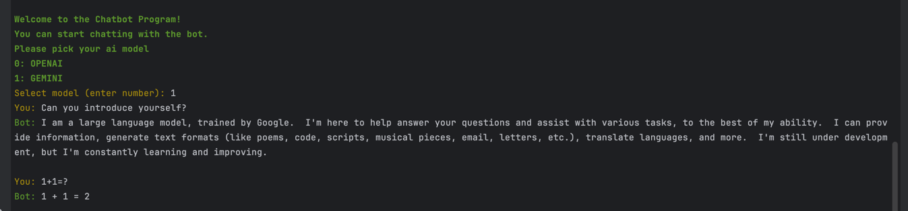

# Chatbot

This is a chatbot written in Node.js that runs in the terminal

## Demo


## Usage

Create a file named `.env` and add the following:

```
OPENAI_API_KEY=YOURKEY
GEMINI_API_KEY=YOURKEY
```

Install dependencies:

```bash
npm Install
```

Run the bot:

```bash
npm start
```

